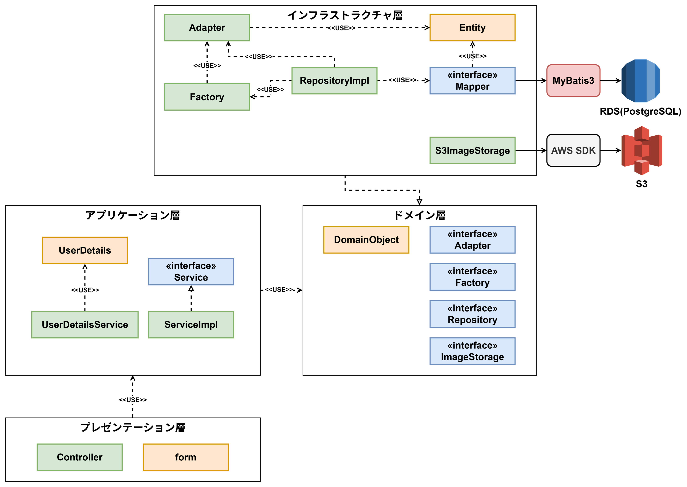

# 文具・雑貨ECサイト Fullness Stationery

Spring Boot × DDD による総合開発演習。管理者向け（商品・注文管理）と顧客向け（購入）の2アプリケーションを、EC2 / RDS / S3 上に Nginx・CI-CD 込みで構築。

---

## 目次

- [概要](#概要)
- [機能一覧](#機能一覧)
- [アーキテクチャ](#アーキテクチャ)
- [技術スタック](#技術スタック)
- [リポジトリ構成](#リポジトリ構成)
- [データモデル](#データモデル)
- [セットアップ（ローカル実行）](#セットアップローカル実行)
- [環境変数](#環境変数)
- [テスト](#テスト)
- [CI/CD・デプロイ](#cicdデプロイ)
- [セキュリティ設計](#セキュリティ設計)
- [規模（LOC）](#規模loc)
- [既知の制約・今後の課題](#既知の制約今後の課題)

---

## 概要

文具・雑貨を販売するECサイト。総合開発演習として、**管理者向けアプリケーション（backend-answer）** と **顧客向けアプリケーション（ec-answer）** の2つを1つのリポジトリで開発している。

- 管理者向け（`backend-answer`）：商品・カテゴリ・在庫の管理、注文履歴の検索、担当者アカウント管理（ユースケース UC009–018）
- 顧客向け（`ec-answer`）：会員登録・ログイン、商品検索、カート、購入、購入履歴（ユースケース UC001–008）

両アプリケーションは同一の RDS（PostgreSQL、データベース名 `fullness-ecx`）と S3 バケット（商品画像）を共有する。

> データベース名を `fullness-ecx`（末尾 x）としているのは、C#版の演習が既に `fullness-ec` を使用しているため、共存できるよう区別している。

---

## 機能一覧

### 顧客向け（ec-answer）

| UC | 機能 | 画面ID | 主なURL |
| --- | --- | --- | --- |
| UC001 | 顧客アカウント登録 | FP003–005 | `/account/form` → `/account/confirm` → `/account/complete` |
| UC002 | 顧客ログイン | FP002 | `/login` |
| UC003 | カテゴリ別商品検索 | FP006–007 | `/products/search`, `/products/detail/{productId}` |
| UC004 | 商品購入（カート追加） | FP008 | `/cart/add`, `/purchase/input` |
| UC005 | 購入確定 | FP009–010 | `/purchase/conform` → `/purchase/complete` |
| UC006 | 購入キャンセル（カート更新・削除） | FP008 | `/cart/update`, `/cart/remove` |
| UC007 | 購入履歴閲覧 | FP011–012 | `/purchase/history`, `/purchase/history/{orderId}` |
| UC008 | 顧客ログアウト | — | `/logout` |

### 管理者向け（backend-answer）


| UC | 機能 | 主なURL |
| --- | --- | --- |
| UC009 | 担当者アカウント登録 | `/admin/account/form` → `/admin/account/confirm` → `/admin/account/complete` |
| UC017 UC18 | 担当者ログイン／ログアウト | `/admin/login`, `/admin/logout` |
| UC010 UC11 UC12 UC13 | 商品情報メンテナンス（検索・登録・修正・削除） | `/admin/product` |
| UC014 | 商品カテゴリ登録 | `/admin/category/form` → `/admin/category/confirm` → `/admin/category/complete` |
| UC015 | 購入履歴検索 | `/admin/order/search` |
| UC016 | 注文ステータス更新 | `/admin/order/status/update` |

---

## アーキテクチャ

### システム構成（本番）

```
利用者 ──HTTP/80──▶ Nginx (EC2)
                     ├─ /admin ─▶ backend-answer  (:8080)
                     └─ /      ─▶ ec-answer        (:8082)
                                     │
                        ┌────────────┴────────────┐
                        ▼                         ▼
                  RDS PostgreSQL             S3（商品画像）
                  (fullness-ecx)            presigned URL / IAMロール
```

### アプリケーション構成（DDD レイヤード）

両アプリケーションとも同じレイヤ構成を採用している。

- `domain` … ドメインモデル（集約）、リポジトリ／ファクトリ／アダプタのインターフェイス、ドメイン例外
- `application` … ユースケースを実現するサービス（トランザクション境界）
- `infrastructure` … MyBatis の Entity / Mapper、Adapter・Factory・RepositoryImpl（永続化の実装）
- `presentation` … Controller、フォーム（入力・バリデーション）
- `config` … Spring Security、セッションスコープ Bean などの設定

主な集約：`Product`（商品＋在庫＋カテゴリ）、`Order`（注文＋注文明細）、`Customer`、`EmployeeAccount`。



---

## 技術スタック

| 分類 | 使用技術 |
| --- | --- |
| 言語 / 実行環境 | Java 17 |
| フレームワーク | Spring Boot 4.0.7（Web MVC / Security / Validation） |
| ビルド | Gradle（Groovy DSL） |
| O/R マッパー | MyBatis（mybatis-spring-boot-starter 4.0.1） |
| テンプレート | Thymeleaf |
| DB | PostgreSQL（本番は AWS RDS） |
| 補助 | Lombok |
| クラウド SDK | AWS SDK for Java v2（S3） |
| インフラ | AWS EC2 / RDS / S3、Nginx（リバースプロキシ） |
| CI/CD | GitHub Actions |

---

## リポジトリ構成

```
FullnessStationery_Java/
├── backend-answer/            # 管理者向けアプリケーション（UC009–018, :8080）
│   ├── src/main/java/jp/co/fullness/ec/backend/
│   ├── src/main/resources/
│   └── build.gradle
├── ec-answer/                 # 顧客向けアプリケーション（UC001–008, :8082）
│   ├── src/main/java/jp/co/fullness/ec/frontend/
│   ├── src/main/resources/
│   └── build.gradle
├── .github/workflows/
│   ├── backend-cicd.yml
│   └── frontend-cicd.yml
└── docs/                      # 各種ガイド
    ├── バックエンドCICDガイド
    └── フロントエンドCICDガイド
```
---

## データモデル

主なテーブル：

- 顧客／注文：`customer`, `orders`, `orders_detail`
- 商品：`product`, `product_stock`, `product_category`
- マスタ：`order_status`（注文済/入金済/配送中/完了）, `payment_method`（現金）
- 管理者：`employee`, `employee_account`, `department`

---

## セットアップ（ローカル実行）

### 前提

- Java 17
- PostgreSQL（ローカル）

### 手順

1. データベースを作成し、スキーマとシードを投入する。

   ```bash
   # 例：backend-answer / ec-answer それぞれの sql を投入
   psql -U postgres -d fullness-ecx -f <スキーマ SQL>
   psql -U postgres -d fullness-ecx -f <シード SQL>
   ```

2. 環境変数を設定する（[環境変数](#環境変数) 参照）。

3. アプリケーションを起動する。

   ```bash
   # 管理者向け（:8080）
   cd backend-answer && ./gradlew bootRun

   # 顧客向け（:8082）
   cd ec-answer && ./gradlew bootRun
   ```

4. ブラウザでアクセスする。

   - 顧客向け：<http://localhost:8082/>
   - 管理者向け：<http://localhost:8080/admin>

---

## 環境変数

両アプリケーション共通で、以下を環境変数（またはサービスの EnvironmentFile）で与える。

| 変数 | 説明 | 例 |
| --- | --- | --- |
| `DB_URL` | JDBC 接続 URL | `jdbc:postgresql://<host>:5432/fullness-ecx` |
| `DB_USERNAME` | DB ユーザー | `postgres` |
| `DB_PASSWORD` | DB パスワード | `<secret>` |
| `AWS_REGION` | S3 リージョン | `ap-northeast-1` |
| `AWS_S3_BUCKET` | 商品画像バケット | `fullness-ec-product-images-furukawa` |

> 実際の認証情報はリポジトリにコミットしない。EC2 上の `/etc/fullness/*.env` と IAM ロールで供給する。

---

## テスト

```bash
cd backend-answer && ./gradlew build   # 管理者向け
cd ec-answer      && ./gradlew build    # 顧客向け
```

テストは 3 層で構成している。

- **Mapper / RepositoryImpl**：`@MybatisTest`＋実 PostgreSQL（トランザクションはロールバック）
- **Controller**：`@WebMvcTest`（Thymeleaf レンダリング、`@AuthenticationPrincipal` は SecurityContext に投入）
- **Service**：Mockito による単体テスト（在庫の悲観ロック・重複チェック・所有者チェックなど）

CI では GitHub Actions のサービスコンテナで PostgreSQL を起動し、スキーマ／シードを投入してからテストを実行する。

---

## CI/CD・デプロイ

- `main` への push をトリガに、**テスト（実 PostgreSQL）→ 成功時に EC2 へ自動デプロイ** を実行する。
- モジュールごとにワークフローを分離（`paths` フィルタで該当ディレクトリの変更のみ起動）。
  - `backend-answer/**` → `backend-cicd.yml`
  - `ec-answer/**` → `frontend-cicd.yml`
- デプロイは JAR を EC2 へ scp 転送し、`systemd`（`fullness-backend` / `fullness-frontend`）を再起動する。
- EC2 に Nginx をパス振り分け（`/admin`→80、`/`→80）で配置。RDS（`fullness-ecx`）と S3（IAM ロールで presigned URL）を両アプリケーションで共有する。

詳細な構築手順は各ガイドを参照：

- [バックエンド CI/CD ガイド](docs/バックエンドCICDガイド.pdf)
- [フロントエンド CI/CD ガイド](docs/フロントエンドCICDガイド.pdf)

---

## セキュリティ設計

- 認証：Spring Security。パスワードは BCrypt でハッシュ化して保存。
  - 顧客：メールアドレス＋パスワードでログイン（`/login`）
  - 管理者：担当者アカウントでログイン（`/admin/login`）
- 認可：顧客側は購入確認・購入完了・購入履歴をログイン必須に限定。購入履歴は本人の注文のみ表示。
- カート：セッションスコープで保持し、ログアウト後も維持（`invalidateHttpSession(false)`）。
- 在庫整合：購入確定時に在庫を悲観ロック（`SELECT ... FOR UPDATE`）→ 数量チェック → 減算 → 注文登録を 1 トランザクションで実行し、同時購入のオーバーセルを防止。
- S3：アクセスキーを置かず、EC2 の IAM ロール（インスタンスプロファイル）で presigned URL を生成。

---

## 規模（LOC）

<!-- TODO: cloc などで計測して記入。例：
     cloc backend-answer/src ec-answer/src --exclude-dir=build
     言語別・モジュール別（本体/テスト）に分けると規模感が伝わる。 -->

| モジュール | 言語 | 本体 | テスト |
| --- | --- | --- | --- |
| backend-answer | Java | 2934 | 2590 |
| ec-answer | Java | 1964 | 1314 |
| （テンプレート等） | HTML/XML | 1538 | 365 |

* 合計:10705

---

## 既知の制約

- 支払い方法はマスタが「現金」のみ（`payment_method`）。
